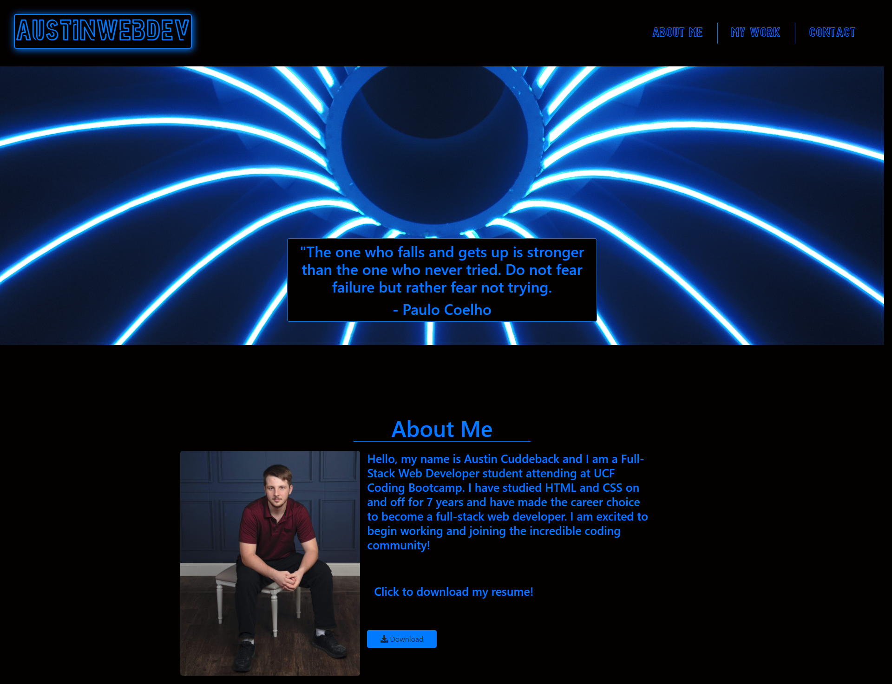

# Hi, my name is Austin Cuddeback 👋

# About Me

💻 I am a Full-Stack Web Web Developer specializing in MERN stack, MySQL, and GraphQL. Love creating web API's and creating user friendly websites!

 

# Languages and Tools:

 
 

# My Projects

## [My Portfolio](https://ajcuddeback.github.io/react-portfolio)

- This is my personal portfolio built with React.js showcasing all of my projects and social links
  
   
   
   

  ## [Dev Connect](https://dev-connect-v2.herokuapp.com/)

- Dev Connect was my second group project from the bootcamp. Built the api for the events page and for all users.
- Description: Dev Connect is an all-in-one platform for developers to meetup, ask questions, and connect with others.

 
 
 

## [Explore Outdoors](https://ajcuddeback.github.io/Explore-Outdoors)

- Explore Outdoors was my first group project from the bootcamp. This project taught me a lot about working well with a team of coders and communication.
- Description: Explore Outdoors is your one stop website to find the perfect destination for your next vacation when you can't decide where to go. Take our 12 question test and find the perfect destination based on six beautiful places we hand picked for you!

 
 
 

## [Hernando Reptile](https://www.hernandoreptile.org)

- Hernando Reptile is an ongoing project with Hernando Reptile and Exotics Rescue.

 

 

## 📫 How to reach me: ...

- Email: [ajcuddeback@gmail.com](ajcuddeback@gmail.com)
